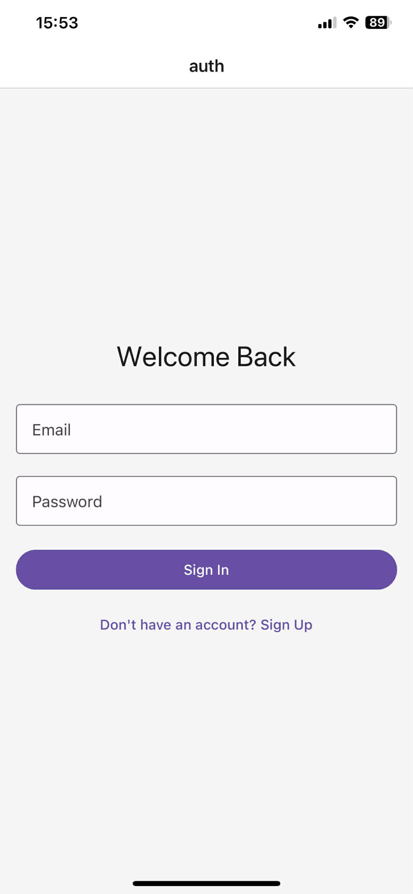
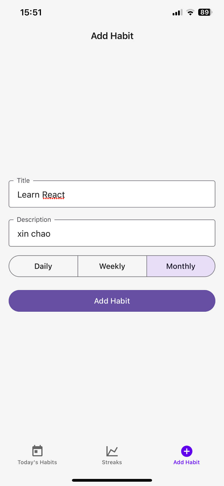

Đây là dự án xây dựng một ứng dụng Habit Tracker hiện đại bằng React Native, Appwrite, Expo và TailwindCSS. Ứng dụng cho phép người dùng theo dõi thói quen hằng ngày, xem chuỗi streak, và quản lý việc hoàn thành thói quen với giao diện đẹp mắt.

---

## Tech

React Native – Xây dựng ứng dụng di động native

Expo – Đơn giản hóa quá trình phát triển React Native

Appwrite – Backend & cơ sở dữ liệu realtime

TailwindCSS – CSS tiện ích-first cho giao diện đẹp

React Hooks – Quản lý state và side-effects

TypeScript (tuỳ chọn) – Tăng độ an toàn và tooling

GitHub – Triển khai 

---

## Tính năng

* 🏅 **Habit Streaks**
  Hiển thị chuỗi habit liên tục.
  
* ✅ **Add/Complete Habits**
  Thêm mới, đánh dấu hoàn thành, xoá habit từ list.

* 🔄 **Real-Time Data**
  Đồng bộ với Appwrite ngay lập tức.

* 🌑 **Dark Mode Support**
  Giao diện tối đẹp mắt với TailwindCSS.

* 📱 **Responsive Design**
  Thiết kế mobile-first với Expo.

* 🚀 **User Authentication**
  Quản lý tài khoản người dùng với Appwrite.

---

### Clone & Run

```bash
git clone https://github.com/yourusername/habit-tracker-react-native.git
cd habit-tracker-react-native
npm install
npm start
````

Ứng dụng sẽ chạy tại: [http://localhost:19002](http://localhost:19002) (cho Expo development)

---

## 🖼️ Demo

| Đăng ký / Đăng nhập | Thêm habit | Hoàn thành / Xóa | Bảng xếp hạng |
|---------------------|------------|------------------|---------------|
|  |  |  |  |


---